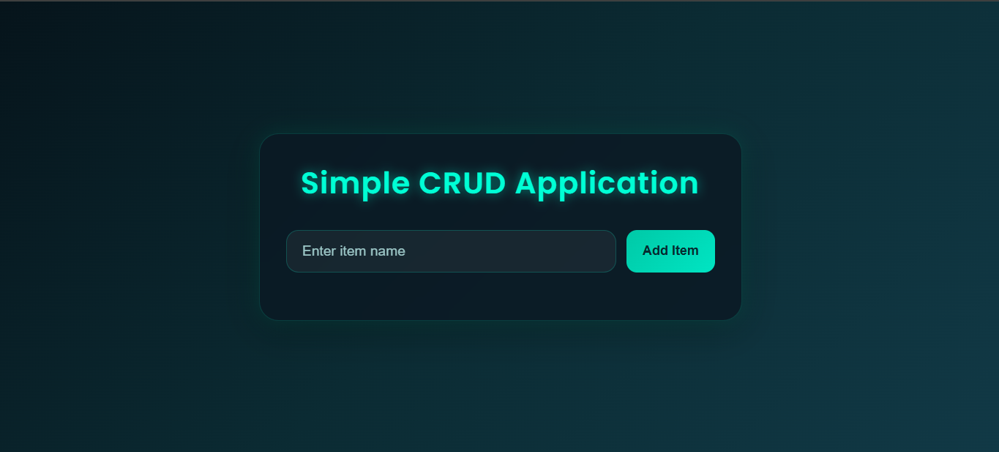
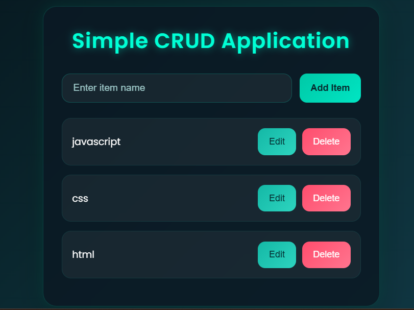
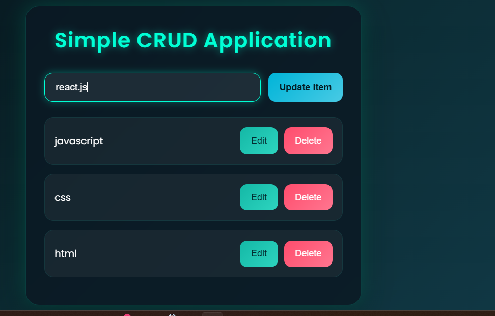

# 🚀 Advanced CRUD List App

A modern and responsive CRUD (Create, Read, Update, Delete) application built using **HTML**, **CSS**, and **JavaScript**.

This project features a modern dark teal UI, smooth animations, responsive layout, and dynamic DOM manipulation.

---

## ✨ Features

* ➕ Add Items
* 📝 Edit Existing Items
* ❌ Delete Items
* 🔄 Update Items Dynamically
* 🎨 Modern Dark Teal UI
* 📱 Fully Responsive Design
* ⚡ Smooth Hover Effects & Animations
* 🧠 DOM Manipulation
* 📂 Array-Based Data Management

---

## 🛠️ Technologies Used

* HTML5
* CSS3
* JavaScript (Vanilla JS)

---

## 📸 Preview








---

## 📁 Project Structure

```bash
project-folder/
│
├── index.html
├── style.css
├── script.js
└── README.md
```

---

## ⚙️ How It Works

### Add Item

Users can add a new item using the input field.

### Edit Item

Existing items can be edited dynamically.

### Delete Item

Items can be removed instantly from the list.

### Update Item

Modified items are updated in real-time.

---

## 🧠 Concepts Used

* Arrays
* forEach Loop
* splice()
* DOM Manipulation
* Event Handling
* Dynamic HTML Rendering
* Template Literals

---

## 🚀 Getting Started

1. Clone the repository

```bash
git clone https://github.com/your-username/advanced-crud-list-app.git
```

2. Open the project folder

3. Run `index.html` in your browser

---

## 🌟 Future Improvements

* Local Storage Support
* Search Functionality
* Drag & Drop Sorting
* Light/Dark Theme Toggle
* Task Completion Status

---

## 👨‍💻 Author

Made with ❤️ by Smriti

---
"# Advanced-CRUD-List-App" 
